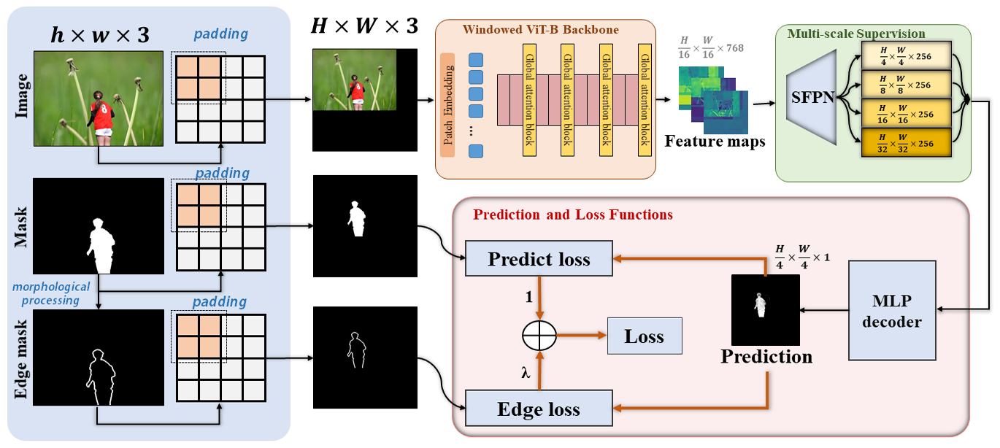
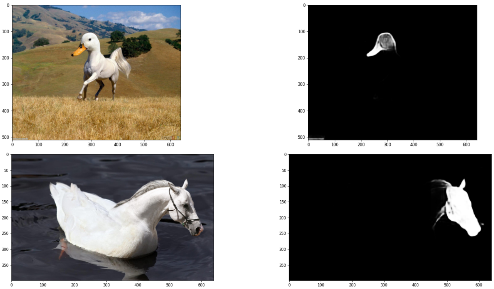

# IML-ViT: Benchmarking Image Manipulation Localization by Vision Transformer
[](https://colab.research.google.com/drive/1SMH0o2tDe2CLvvIACA1-Ej2lRNDBRfyj?usp=sharing)
 


[](https://GitHub.com/Sunnyhaze) 

This repo contains an official PyTorch implementation of our paper: [IML-ViT: Benchmarking Image Manipulation Localization by Vision Transformer.](http://arxiv.org/abs/2307.14863)




## 🔥0 Recommend 
- If you are doing research on image manipulation detection/localization, or want to implement your own IML-ViT, we highly recommend that you follow these two repos:

<a href="https://github.com/scu-zjz/imdlbenco">
  
</a> 
<a href="https://github.com/Sunnyhaze/iml-vit-imdlbenco">
  
</a>

## 📰1 News 
- [2024/09/28] 🎉🎉Our latest work [IMDL-BenCo](https://github.com/scu-zjz/IMDLBenCo), a modular codebase and benchmark for image manipulation detection/localization has been accepted by ***NeurIPS 2024*** Dataset and Benchmark Track as ***spotlight***! Welcome to follow!🎉🎉
- [2024/03/24] We released the latest IML-ViT checkpoint, including a better CASIAv2 trianed checkpoint and a [CAT-Net](https://github.com/mjkwon2021/CAT-Net) protocol checkpoint ([TruFor](https://github.com/grip-unina/TruFor) also follow this protocol). The default checkpoint for our Google Colab Demo will be replaced with them. Download links: [Google Drive](https://drive.google.com/drive/folders/1Ztyiy2cKJVmyusYMUlwuyPecBefTJCPT?usp=sharing) or [Baidu NetDisk](https://pan.baidu.com/s/1IqyJdFLUo9bXEhvqOJkvvg?pwd=2k0o).
- [2024/03/19] We have received numerous requests concerning datasets such as COVERAGE, primarily due to **resolution discrepancies between images and masks**. Consequently, we have uploaded several IML datasets that have been meticulously corrected to the [IML-Dataset-Corrections](https://github.com/SunnyHaze/IML-Dataset-Corrections) repository for the convenience of the research community.
- [2023/12/24] Training code released! Welcome to discuss and report the bugs and interesting findings! We will try our best to improve this work.
- [2023/10/03] 🎉🎉 **Our work that applies Contrastive learning on the image manipulation localization task to solve data insufficiency problem, NCL-IML**, is accepted by ***ICCV2023***! 🎉🎉
  - [[**paper**](https://openaccess.thecvf.com/content/ICCV2023/html/Zhou_Pre-Training-Free_Image_Manipulation_Localization_through_Non-Mutually_Exclusive_Contrastive_Learning_ICCV_2023_paper.html)][[**code**](https://github.com/Knightzjz/NCL-IML)]

## 2 Our environment
Ubuntu LTS 20.04.1

CUDA 11.7 + cudnn 8.4.0

Python 3.8

PyTorch 1.11

## 3 Quick Start
### 3.1 Google Colab Demo [](https://colab.research.google.com/drive/1SMH0o2tDe2CLvvIACA1-Ej2lRNDBRfyj?usp=sharing)
- We highly recommend you try out our IML-ViT model on Colab!
- We also prepared a playground for you to test our model with various images on the Internet conveniently.
  - 

### 3.2 A Simple Offline Demo
Currently, You can follow the tutorial to experience the running pipeline of IML-ViT. The only difference from the Colab version is the lack of a playground for testing online images.

- Step 1: You should install the packages in [requirements.txt](./requirements.txt) with `pip install -r requirements.txt` first.
- Step 2: You should download the pre-trained IML-ViT weights from [Google Drive](https://drive.google.com/drive/folders/1Ztyiy2cKJVmyusYMUlwuyPecBefTJCPT?usp=sharing) or [Baidu NetDisk](https://pan.baidu.com/s/1IqyJdFLUo9bXEhvqOJkvvg?pwd=2k0o) and place the checkpoint you selected as `./checkpoints/iml-vit_checkpoint.pth`. 
- Step 3: You can follow the instructions in [Demo.ipynb](./Demo.ipynb) to see how we pad the images and inference with the IML-ViT. 

### 3.3 Training on your datasets
**Now training code for IML-ViT is released!**

First, you may prepare the dataset to fit the protocol of our dataloader for a quick start. Or, you can design your dataloader and modify the corresponding interfaces.

#### 3.3.1 Prepare IML Datasets
- We defined two types of Dataset class
  - `json_dataset`, which gets input image and corresponding ground truth from a JSON file with a protocol like this:
    ```
    [
        [
          "/Dataset/CASIAv2/Tp/Tp_D_NRN_S_N_arc00013_sec00045_11700.jpg",
          "/Dataset/CASIAv2/Gt/Tp_D_NRN_S_N_arc00013_sec00045_11700_gt.png"
        ],
        ......
        [
          "/Dataset/CASIAv2/Au/Au_nat_30198.jpg",
          "Negative"
        ],
        ......
    ]
    ```
    where "Negative" represents a totally black ground truth that doesn't need a path (all authentic)
  - `mani_dataset` which loads images and ground truth pairs automatically from a directory having sub-directories named `Tp` (for input images) and `Gt` (for ground truths). This class will generate the pairs using the sorted `os.listdir()` function. You can take `images\sample_iml_dataset` as an example.
- These datasets will do **zero-padding** automatically. Standard augmentation methods like ImageNet normalization will also be added. 
- Both datasets can generate `edge_mask` when specifying the `edge_width` parameter. Then, this dataset will return 3 objects (image, GT, edge mask) while only 2 objects when `edge_width=None`.
- For inference, returning the actual shape of the original image is crucial. You can set `if_return_shape=True` to get this value. 

Thus, you may revise your dataset like `mani_dataset` or generate a `json` file for each dataset you are willing to train or test. We have prepared the [Naive IML transforms class](./utils/iml_transforms.py) and [edge mask generator class](./utils/edge_generator.py). You can call them directly using `json_dataset` or `mani_dataset` in [./utils/datasets.py](./utils/datasets.py) to check if your revising is correct.

#### 3.3.2 Prepare the Pre-trained Weights
You may follow the [instructions](./pretrained-weights/mae_download_page.md) to download the Masked Autoencoder pre-trained weights before training. Thanks for their impressive work and their open-source contributions!

#### 3.3.3 Start Training Script
The main entrance is [main_train.py](main_train.py), you may use the following script to call training on Linux:

```bash
torchrun \
  --standalone \
  --nnodes=1 \
  --nproc_per_node=1 \
main_train.py \
  --world_size 1 \
  --batch_size 1 \
  --data_path "<Your custom dataset path>/CASIA2.0" \
  --epochs 200 \
  --lr 1e-4 \
  --min_lr 5e-7 \
  --weight_decay 0.05 \
  --edge_lambda 20 \
  --predict_head_norm "BN" \
  --vit_pretrain_path "<Your path to pre-trained weights >/mae_pretrain_vit_base.pth" \
  --test_data_path "<Your custom dataset path>/CASIA1.0" \
  --warmup_epochs 4 \
  --output_dir ./output_dir/ \
  --log_dir ./output_dir/  \
  --accum_iter 8 \
  --seed 42 \
  --test_period 4 \
  --num_workers 4 \
  2> train_error.log 1>train_log.log
```
`data_path` is for training dataset
`test_data_path` is for testing dataset during the training process
`vit_pretrain_path` is the path for MAE pre-trained ViT weights

You should modify the path in `<>` to your custom path. The default settings are generally recommended training parameters, but if you have a more powerful device, increasing the batch size and adjusting other parameters appropriately is also acceptable.


Note that we observed that the `predict_head_norm` parameter, i.e. norm type of the predict_head may greatly influence the performance of the model. Some conclusions are here:

> We tested three different types of normalization in the decoder head, and they may yield different results due to dataset configurations and other factors.
> Some intuitive conclusions are as follows:
>   - "LN" -> Layer norm : The fastest convergence, but poor generalization performance.
>   - "BN" Batch norm : When include authentic images during training, set batchsize = 2 may have poor performance. But if you can train with larger batchsize (e.g. NVIDIA A40 with 48GB memory can train with batchsize = 4) It may performs better.
>  - "IN" Instance norm : A form that can definitely converge, equivalent to a batchnorm with batchsize=1. When abnormal behavior is observed with BatchNorm, one can consider trying Instance Normalization. It's important to note that in this case, the settings of `nn.InstanceNorm2d` should include setting `track_running_stats` and `affine` to True, rather than the default settings in PyTorch.


Anyway, We sincerely welcome to report other strange/shocking findings among the parameter settings in the issue. This can contribute to a more comprehensive understanding of the inherent properties of IML-ViT in the research community.

For more information, you may use `python main_train.py -h` to see the full help list of the command arguments. 


#### 3.3.4 Monitor the Training Process
We recommend you monitor the training process with the following measures:
- Check the logging file:
  - We have redirected the standard output to the `train_log.log` file. If the training proceeds correctly, you can check the latest status at the end of this file.
- Using TensorBoard
  - For a more vivid and straightforward visualization, you can call a Tensorboad process under the `./output_dir` with the command `tensorboard --logdir ./`. Then you can see the statistics and graphs with Internet Explorer.

#### 3.3.5 Visualize the results
You can use our [Colab demo](https://colab.research.google.com/drive/1SMH0o2tDe2CLvvIACA1-Ej2lRNDBRfyj?usp=sharing) or [offline demo](./Demo.ipynb) to check the performance of our powerful IML-ViT model. The only difference is to replace the default checkpoint with your own.

## 4 Links
If you want to train this Model with the CASIAv2 dataset, we provide a revised version of CASIAv2 datasets, which corrected several mistakes in the original datasets provided by the author. Details can be found in the [link](https://github.com/SunnyHaze/IML-Dataset-Corrections) shown below:

[](https://github.com/SunnyHaze/IML-Dataset-Corrections)

[](https://github.com/SunnyHaze/CASIA2.0-Corrected-Groundtruth)

## 5 Citation
If you find our work interesting or helpful, please don't hesitate to give us a star🌟 and cite our paper🥰! Your support truly encourages us!
```
@misc{ma2023imlvit,
      title={IML-ViT: Benchmarking Image Manipulation Localization by Vision Transformer}, 
      author={Xiaochen Ma and Bo Du and Zhuohang Jiang and Ahmed Y. Al Hammadi and Jizhe Zhou},
      year={2023},
      eprint={2307.14863},
      archivePrefix={arXiv},
      primaryClass={cs.CV}
}
```

****

## 6 Statistic of This Repo

<div align="center"> 
  
[](https://star-history.com/#SunnyHaze/IML-ViT&Date)

</div>

<div align="center"> <a href="https://info.flagcounter.com/9Etf"></a> </div>
